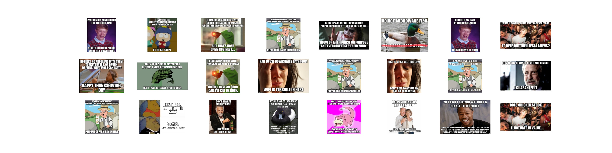

# Reddit_classification

This project is an classification of memes  scraped from 
<a href="https://www.reddit.com/r/AdviceAnimals/">r/AdviceAnimals</a>
reddit thread by different categories

Project is made for Vilnius School of AI

Data: unlabled meme images

Goal: train a model that can classify background image of meme

